# 遊び方の解説ページ：案

中学生が読んでも分かる言葉で、このゲームを説明するページの案です。QRの先の公開ページや、会場の入口の案内、配るプリントの元にする想定です。前半が「ページに載せる文章と画像」、後半が「作った人向けの覚え書き」です。

画像は`docs/images/解説ページ/`にあります。本文は2026年9月23日の「順番に」に合わせています。写真はこのPCの見本を仮の時計で進めて撮ったものです。人の手と声の確認とは分けています。note用の本文と画像は`docs/note記事/`です。

---

## ここからページの本文

# はじまりの魔法：90秒

## 手で描いて、声で唱えると、自分だけの魔法になる

これは、あなたが魔法使いになるゲームです。
カメラの前で手を動かすと、その動きが光の線になります。
まず声で魔法を作り、次は手で盾を描きます。最後は手で描き、合図のあとに「雷よ、七つに分かれろ」のように唱えて、大きな魔法を放ちます。
できた魔法は、目の前の騎士へ飛んでいきます。

時間は90秒。その間に魔法を3回作って放ち、最後に騎士を倒します。
90秒が終わると、あなたが作った3つの魔法が「魔導書」にまとめて表示されます。

## このゲームの目的

目の前にいる「遺跡の騎士」を倒すことです。
ただし、うまく描けなくても、うまく唱えられなくても、負けることはありません。
魔法は必ず放たれ、騎士の攻撃は必ず防げます。

このゲームで味わってほしいのは、自分の動きと言葉から、自分だけの魔法が生まれる瞬間です。

## 遊ぶ前に

- カメラの前に座ります。片手が動けば大丈夫です。立ったり、大きく腕を振ったりする必要はありません。
- 口元にマイクが付いたヘッドセットを使います。声を出しにくいときは「マイクで唱える」を外すと、「同時に」の遊び方に変わり、文字で言葉を入れられます。
- 「魔法をつくる」を押すと、3秒のカウントダウンが始まります。この間に、描き始めたい場所へ手を動かしておきます。

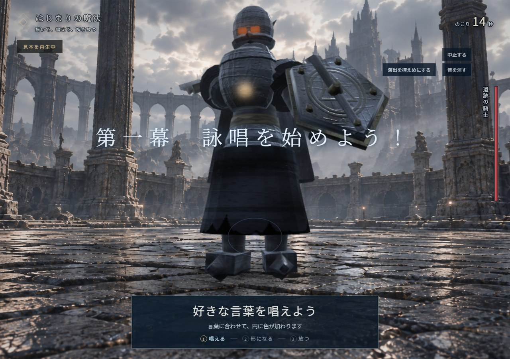

## 90秒の流れ

初めての人向けの「順番に」は、3つの場面に分かれています。

- 1回目：最初の魔法（0秒から26秒）。声で唱えて、放つ。
- 2回目：防御（26秒から50秒）。赤い印を囲んで盾を作り、騎士の一撃を止める。
- 3回目：とどめ（50秒から90秒）。前の光を集め、全力で唱えて、騎士を倒す。

### 1回目：最初の魔法（0秒から26秒）

**声で作る。** 画面の下寄りに円が出ます。この回は手で描かず、好きな言葉を唱えます。

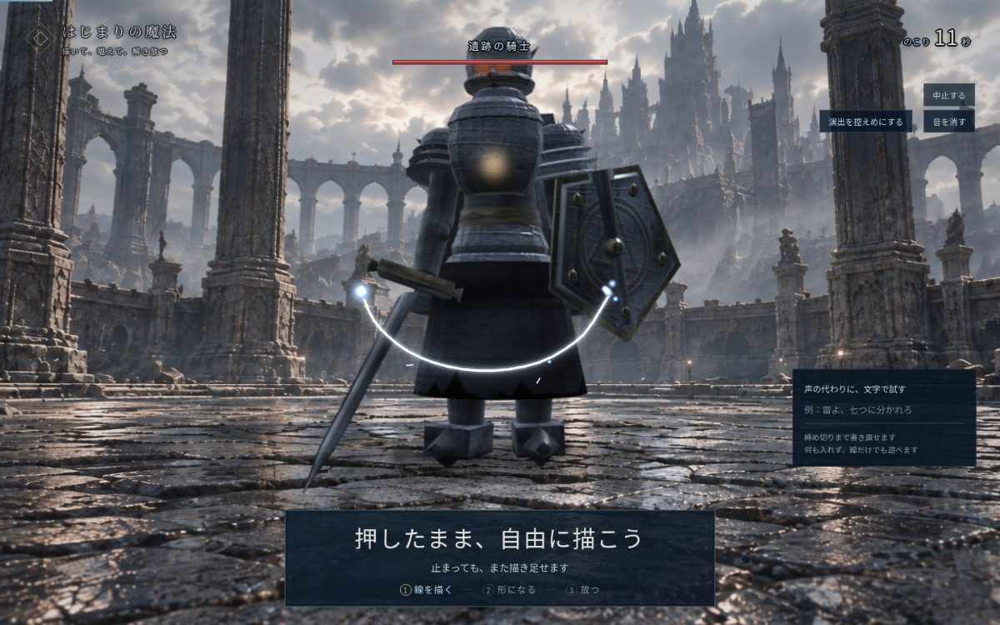

**言葉を重ねる。** 「雷」と言えば黄色い光、「氷」なら水色の結晶、「壁」なら面が加わります。「螺旋」で部品が回り、「顕現」で光が増します。言葉は14秒まで受け付けます。

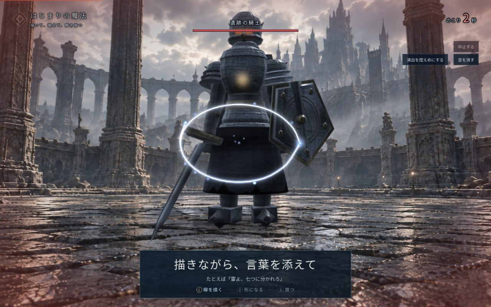

**完成する。** 14秒で受付が終わると、積んだ部品が中心に集まっていきます。聞き取った言葉は「雷・7つ」のように小さく表示されます。ここからは手を止めて、見ているだけで大丈夫です。

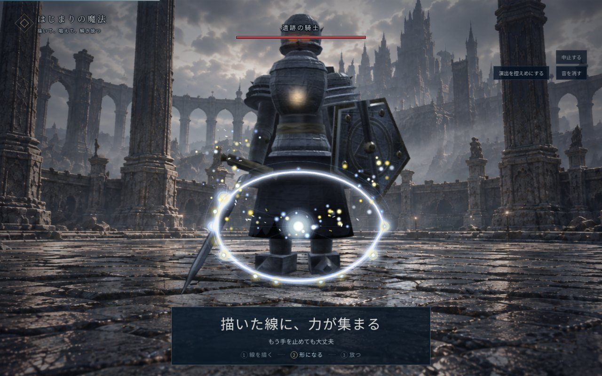

**放つ。** 18秒、魔法が飛び出して騎士に当たります。画面の下に魔法の名前が出ます。この例では「7つの雷の連弾」です。

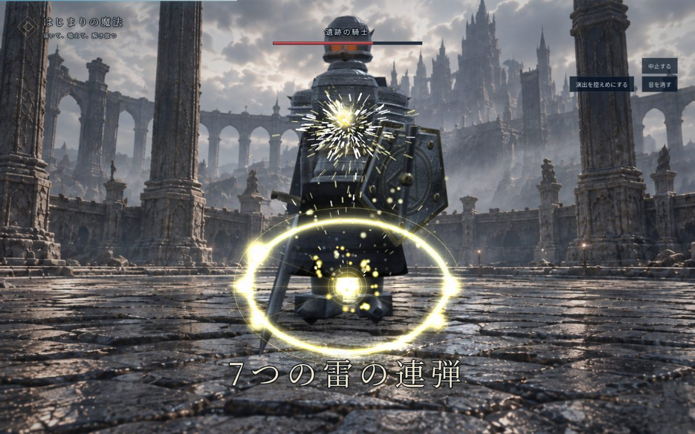

### 2回目：防御（26秒から50秒）

**赤い印を囲む。** 24秒から騎士が剣を構え、26秒になると画面の左寄りに赤い印が出ます。騎士の一撃はここに来ます。印のまわりをぐるっと囲むように線を描きます。

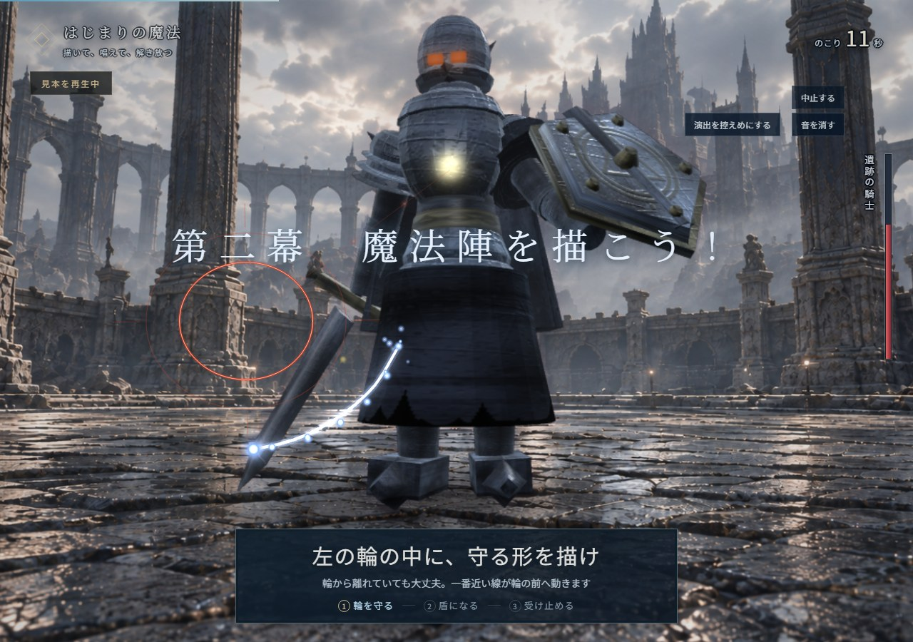

**囲めると色が変わる。** 囲めた瞬間、印の色が赤から白金色に変わります。囲んだ形がそのまま盾になります。
囲めなくても大丈夫です。輪に線が掛かっていれば、その線が描いた場所のまま盾になります。輪から離れていても、印に一番近い線が自動で印の前に動いて、盾になります。何も描かなかったときも、小さな光の玉が守ってくれます。

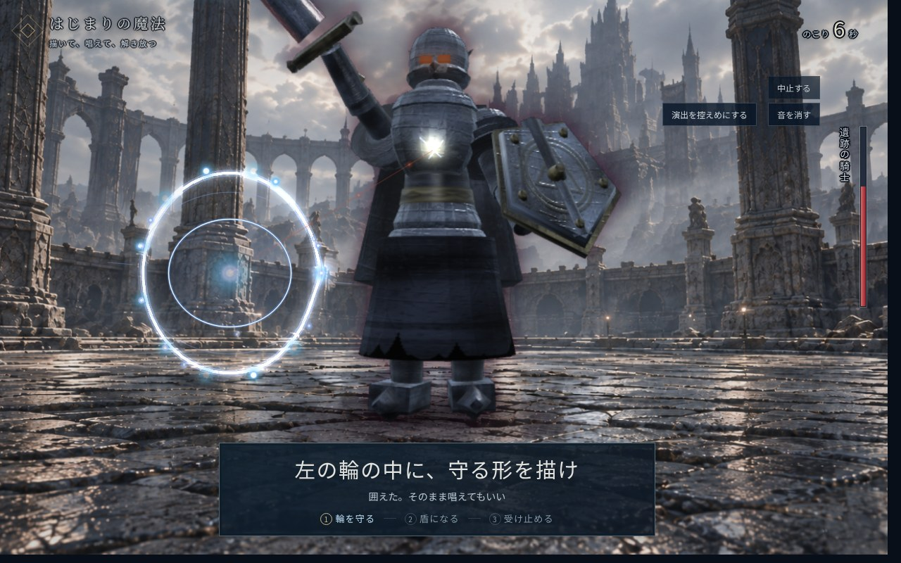

**描いた形で止め方が変わる。** この回は声を使いません。輪を囲えば一撃を弾き返します。線が輪に掛かっていれば受け止め、離れていれば線が移動して一撃をかき消します。

**騎士の一撃を止める。** 40秒ごろ、騎士が剣を振り下ろし、42.4秒に盾へ一撃が届きます。それをあなたの盾が止めます。

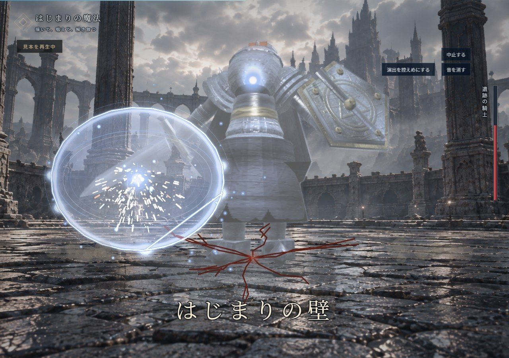

**弱点が出る。** 一撃を止められた騎士はよろけ、胸当てが外れて、胸の中で光る核が見えます。これが弱点です。

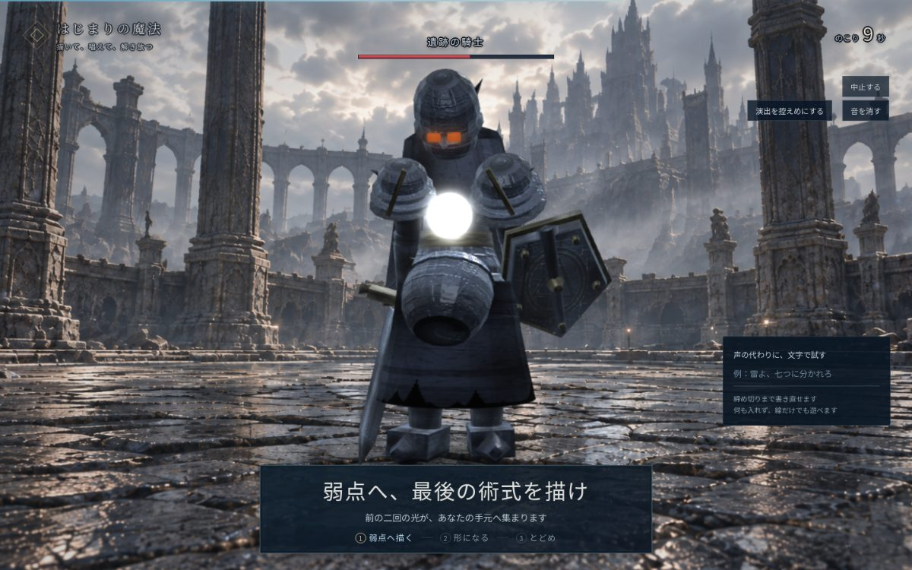

### 3回目：とどめ（50秒から90秒）

**光が集まる。** 50秒になると、1回目と2回目の光の点が、画面の左右から真ん中に集まってきます。そこに新しい線を描き足します。

**合図のあとに唱える。** 62秒で「手を止めて、詠唱を始めよう！」と出ます。線はそこで固まります。手を止めて、72秒まで唱えます。描いた線の上に、言葉の色や形が増えます。

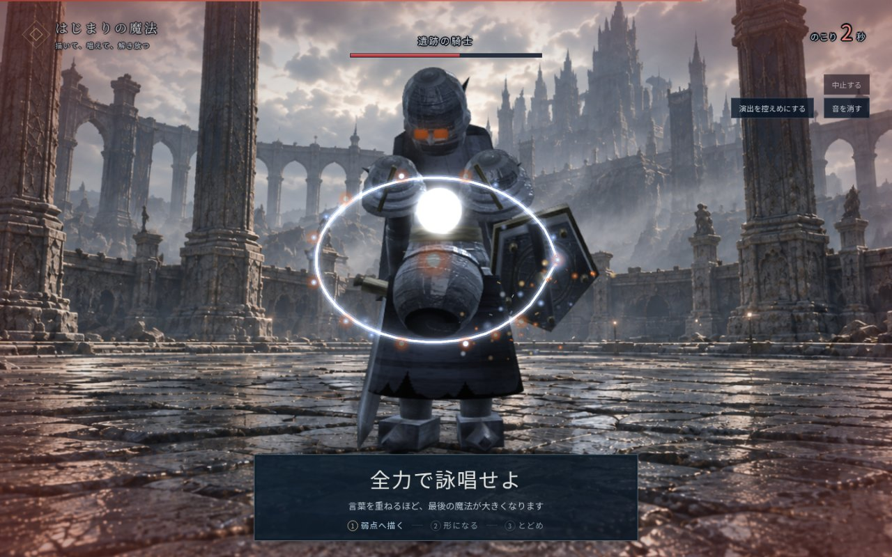

**ためて、放つ。** 72秒で受付が終わると、光が中心に吸い込まれ、画面が暗くなります。一瞬すべてが止まったあと、76秒に魔法が飛び出します。

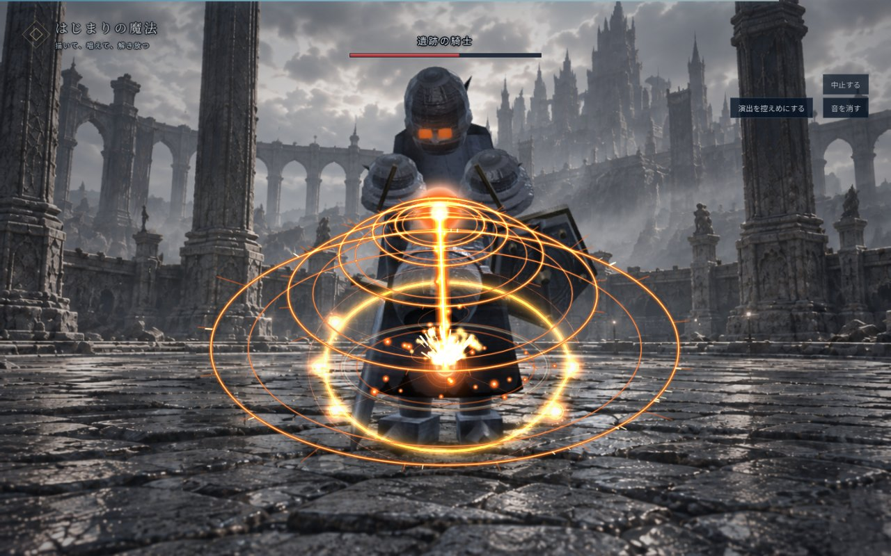

**とどめの一撃。** 魔法は騎士の肩、盾、兜、胸当てに次々と当たり、最後に胸の核に大きな一撃が入ります。

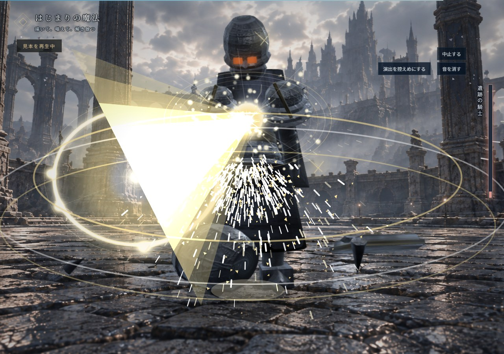

**騎士が倒れる。** 核が砕けると、騎士は剣を落とし、膝をつき、こちらへ倒れてきます。画面にあなたの魔法の名前が浮かびます。

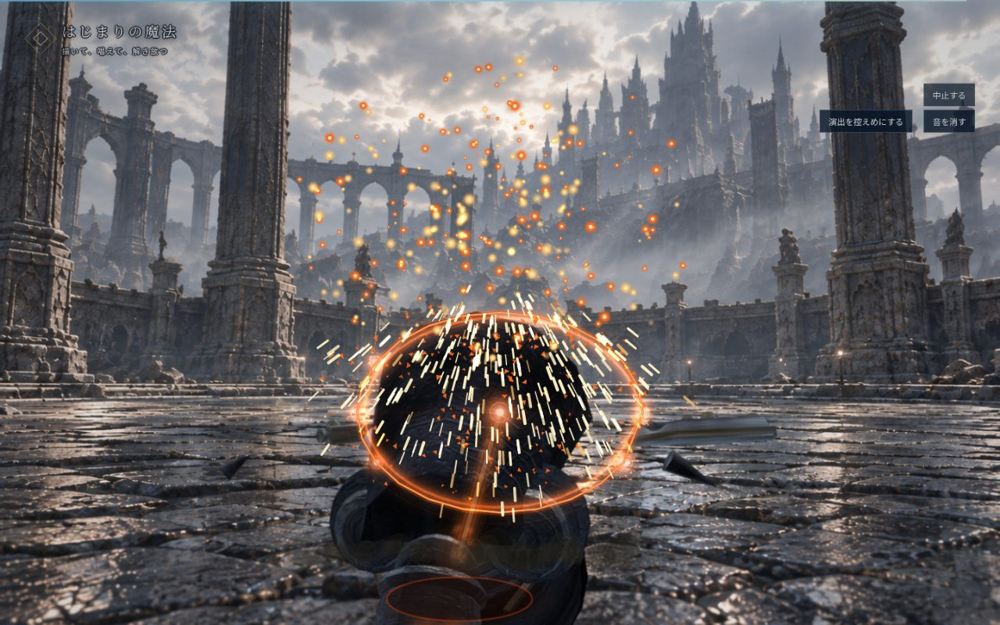

### 結果：魔導書

90秒になると、魔導書が開きます。
左には最後に描いた魔法の形、右には魔法の名前と、「光」「攻撃」「光線」のような札、唱えた言葉、確認番号が並びます。
下には、今日作った3つの魔法が絵つきで並びます。一回目は言葉の色を持つ円です。

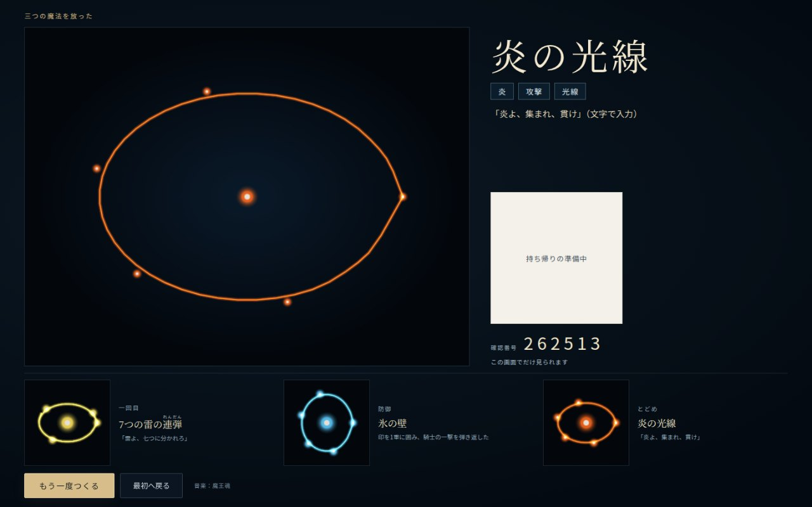

## 楽しいところ

- **動かした瞬間に光る。** 手を動かすと、遅れずに光の線がついてきます。
- **描いた形がそのまま残る。** きれいな円に直されたりはしません。描いた形はそのままに、光の点と線が足されて魔法になります。
- **言った言葉が色と形になる。** 「雷」と言えば黄色い稲妻に、「氷」と言えば水色の結晶になります。
- **自分の盾で攻撃を止める。** 2回目に囲んだ形がそのまま盾になり、騎士の一撃を受け止めます。
- **前の2回の光が最後に戻ってくる。** とどめの回では、1回目と2回目の光が手元に戻ってきて、最後の大きな魔法の一部になります。
- **魔法に名前がつく。** 「7つの雷の連弾」「氷の壁」のように、言葉と形から名前が決まります。

## もっと面白くする工夫

失敗はありませんが、ちょっと工夫すると、魔法の見た目がはっきり変わります。

### 言葉の工夫

- **属性の言葉**で、色と見た目が変わります。炎、氷、雷、風、光、闇の6つです。
- **形の言葉**で、魔法の形が変わります。壁、結界、波、光線、球、連弾などです。
- **数**を言うと、弾の数が変わります（8つまで）。「七つに分かれろ」「三本」のように言います。
- **動きの言葉**で、飛び方が変わります。「追え」と言えば騎士を追いかけ、「螺旋」と言えば回転しながら飛びます。
- **使い方の言葉**で、攻めるか、守るか、縛るか、自分を強めるかが変わります。「貫け」「守れ」「縛れ」「我に力を」などです。

属性を2つ言うと、先に言った方が中心の色、後に言った方が飾りの色になります。「炎と氷」なら、赤に水色が混じります。
「雷ではなく氷」のように言い直すと、後に言った方が使われます。
かっこいい言葉も通じます。「紅蓮（ぐれん）」は炎、「雷霆（らいてい）」は雷、「氷晶（ひょうしょう）」は氷、「常闇（とこやみ）」は闇として聞き取ります。開始画面の「詠唱の言葉を見る」に、110の言葉が載っています。
魔法の名前は、数、属性、形の組み合わせで決まります。「七つ」「雷」「分かれろ」と言えば、「7つの雷の連弾」になります。

### 描き方の工夫

- **1回目。** 手は描きません。言葉を変えて、色や形を見比べてください。
- **2回目。** 囲う、線を掛ける、離して描く、で一撃の止め方が変わります。囲んだ回数で盾が重なります。
- **3回目。** 前の光が集まる場所に描き、合図のあとに唱えます。描いた形は残したまま、言葉の部品が増えます。

### 声の工夫

- マイクに近づいて、はっきりと、ふだんの速さで話します。大きな声は要りません。
- 「雷よ、七つに分かれろ」のように短く区切ると、聞き取ってもらいやすくなります。
- 言葉は途中で言い直せます。最後に言ったことが使われます。

## 慣れたら「同時に」でも遊べます

開始画面の「遊び方を選ぶ」で「同時に」を選ぶと、ページを読み込み直します。三回とも描きながら唱えられます。一回目は0〜30秒、防御は30〜56秒、とどめは56〜90秒です。防御では「弾き返せ」「かき消せ」の言葉で止め方を選びます。

## よくある質問

**声を出すのが恥ずかしい。** 「マイクで唱える」を外すと「同時に」に切り替わり、言葉を文字で入れられます。線だけでも魔法は出ます。

**手がうまく映らない。** 「マウスで試す」を選べば、マウスを押したまま動かして描けます。

**赤い印を囲めなかった。** 印に一番近い線が自動で印の前に動いて、必ず守ってくれます。

**途中で手を止めてしまった。** 受付が終わるまでは、いつでも描き足せます。手を止めても魔法は消えません。

**光が強いのが苦手。** 画面右上の「演出を控えめにする」を押すと、光や揺れが弱くなります。

## 安心してほしいこと

カメラの映像と声は、パソコンの外には送りません。録画も録音もしません。
残るのは、描いた線の形と、聞き取った言葉の文字だけです。

## ここまでページの本文

---

## 作った人向けの覚え書き

### このページをどこに置くか

| 置き場所 | 使い方 | 載せる量 |
| --- | --- | --- |
| QRで開く案内（`guide/`） | 遊ぶ前にスマホで読み、パソコンで遊ぶ | 3回の流れ、言葉の例、パソコンの前ですることだけ。作成済み |
| QRの先の公開ページ | 遊んだ後に、自分の魔導書と一緒に読む | 本文をそのまま |
| 会場の入口の案内 | 並んでいる間に読む | 「90秒の流れ」の表と「もっと面白くする工夫」の言葉の表だけ |
| 配るプリント | 持ち帰って家で読む | 本文から画像を5枚ほどに減らす |

公開ページは設計仕様の「第五段階」で、まだ作っていません（[文書の一覧](README.md)の「段階ごとの進み具合」を参照）。ページを作るときは、この文章をそのまま元にできます。

### 本文で気をつけたこと

- 一文を短くし、秒数は場面の区切りだけに絞った。細かい秒数（18秒で受付終了、21秒で確定など）は本文に入れていない。仕様の時刻を変えないため、書くときは[動きの詳細](動きの詳細.md)の表をそのまま使う。
- 「負けない」「必ず守れる」ことを先に伝えた。中学生は失敗を怖がりやすいため。
- 「工夫」は、コードで実際に変わることだけを書いた。属性と形の言葉は `src/game/spell-words.ts`、数と飛び方は `src/game/recipe.ts`、盾の決め方は `src/game/guard.ts` に合わせてある。
- 「言葉を重ねるほど、最後の魔法が大きくなります」は、ゲームの画面に出ている案内文をそのまま引いた。言葉の数で演出がどれだけ変わるかは、実機で確かめていない。

### 差し替えたい画像

今の15枚は「順番に」の見本を仮の時計で進めた画面です。実際の声の聞き取りや、手の追従の確認には使いません。会場で人の手と声を使った写真も用意してください。

開始画面の撮影では、音声認識の準備ができた状態を仮に返しています。写真だけでは、音声認識が実際に動いたとは判断できません。

撮り直すときは、Macで `npm run dev` を起動してから `npx tsx scripts/capture-guide.mjs --flow=sequential` を走らせると、同じ15枚が `test-results/guide/sequential/` に出ます。撮る時刻は回の表（`src/game/rounds.ts`）から作っているので、秒数を変えても同じ場面が撮れます。マイクで遊んだ画面は、実際に遊びながら画面撮影で残します。

### まだ確認していないこと

- 中学生に読んでもらって、分からない言葉がないか。
- 人の手と声で遊んだときに、本文どおりに見えるか（人による確認は未実施。[実装と確認の記録](実装と確認の記録.md)）。
- 「もっと面白くする工夫」を読んだ人が、実際に魔法を変えられるか。
